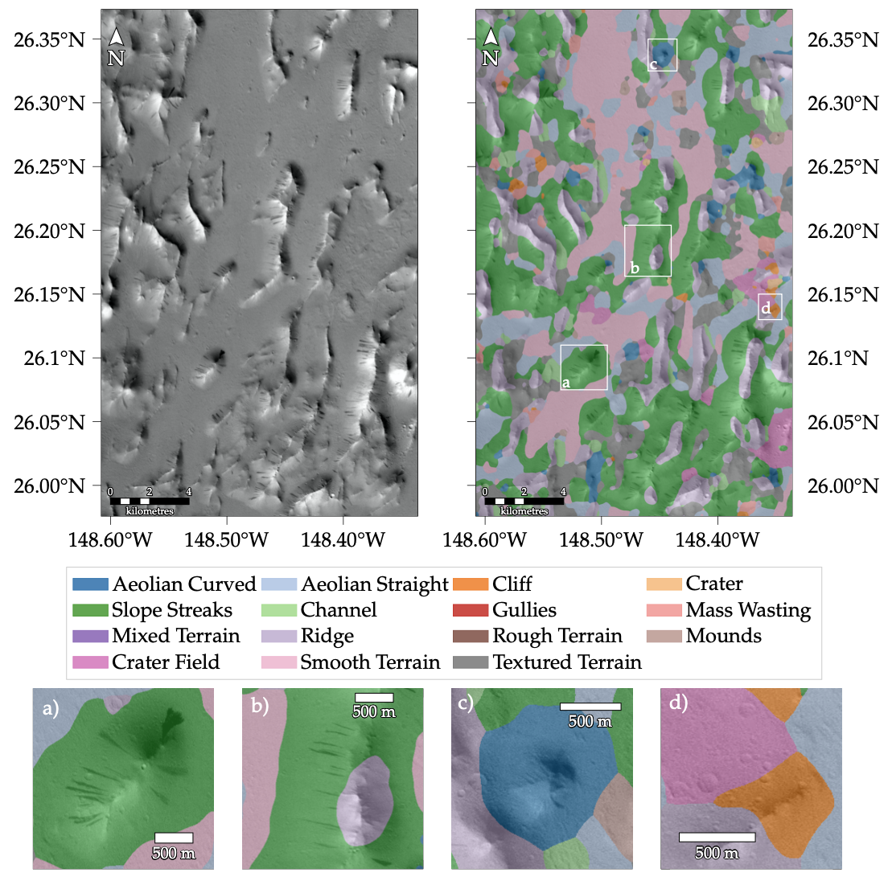
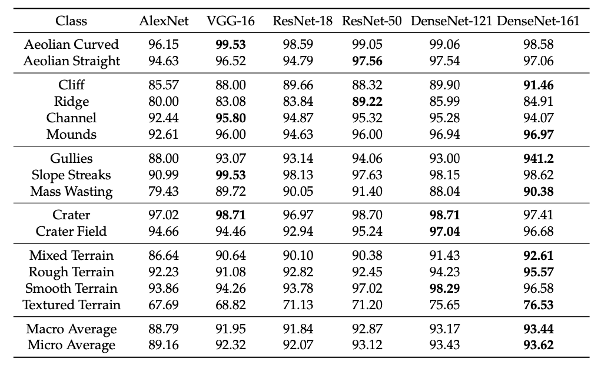
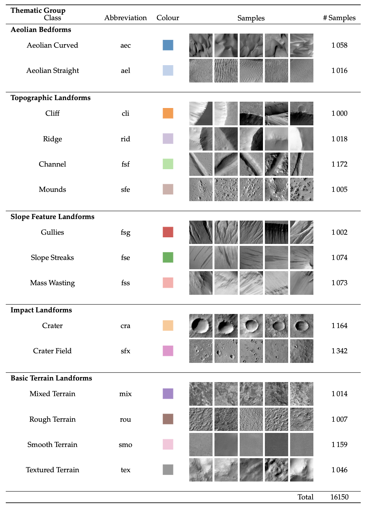

# DoMars16k: A Diverse Dataset for Weakly Supervised Geomorphologic Analysis on Mars

### [Paper](https://dx.doi.org/10.3390/rs00010005 "Paper") | [Data](https://dx.doi.org/10.5281/zenodo.4291940 "Data")

Thorsten Wilhelm, Melina Geis*, Jens Püttschneider*, Timo Sievernich*, Tobias Weber*, Kay Wohlfarth and Christian Wöhler, TU Dortmund University, * These authors contributed equally to this work.

This repository contains the code to recreate the tables and figures of the paper "DoMars16k: A Diverse Dataset for Weakly Supervised Geomorphologic Analysis on Mars"

## Results

### Automated Geomorphic Map Creation


### Classification Metrics


## Classes


## Usage
### Installation
Create a conda environment from the requirements
```
conda create --name geomars --file requirements.txt
```
Run `setup.py` to download the pre-trained networks and the dataset. The code was tested with Ubuntu 18.04.4 LTS, an NVIDIA RTX6000, and CUDA 10.1.

### Configuration
The individual scripts can be adjusted by modifying the corresponding entries in the `hyper_params` dictionary. For evaluating different models or creating maps with different models only the `model` entry needs to be changed.

```python
hyper_params = {
    'batch_size': 64,
    'num_epochs': 30,
    'learning_rate': 1e-2,
    'optimizer': 'sgd',
    'momentum': 0.9,
    'model': 'densenet161',
    'num_classes': 15,
    'pretrained': True,
    'transfer_learning': False,
}
```
### Training
Run `training.py` to train a neural network according to the definitions in the `hyper_params` dictionary. 

### Evaluation
Run `eval.py` to load a pre-trained network from the `models` folder according to the definitions in the `hyper_params` dictionary. 

### Mapping
Run `make_map.py` to load a pre-trained network from the `models` folder according to the definitions in the `hyper_params` dictionary. The analysed image can be changed by modifying `CTX_stripe`. Three CTX images are already configured:
* Jezero Crater - [D14_032794_1989_XN_18N282W](http://viewer.mars.asu.edu/viewer/ctx/D14_032794_1989_XN_18N282W)
* Oxia Planum - [F13_040921_1983_XN_18N024W](http://viewer.mars.asu.edu/viewer/ctx/F13_040921_1983_XN_18N024W)
* Lycus Sulci - [G14_023651_2056_XI_25N148W](http://viewer.mars.asu.edu/viewer/ctx/G14_023651_2056_XI_25N148W)


## Citation
If you find this work useful please consider citing:

```
@article{wilhelm2020domars16k,
  title={DoMars16k: A Diverse Dataset for Weakly Supervised Geomorphologic Analysis on Mars},
  author={Wilhelm, Thorsten and Geis, Melina and P\"uttschneider, Jens and Sievernich, Timo and Weber, Tobias and Wohlfarth, Kay and W\"ohler, Christian},
  journal={Remote Sensing},
  year={2020},
  doi = {10.3390/rs00010005},
  url = {https://dx.doi.org/10.3390/rs00010005},
  publisher={Multidisciplinary Digital Publishing Institute}
}
```
